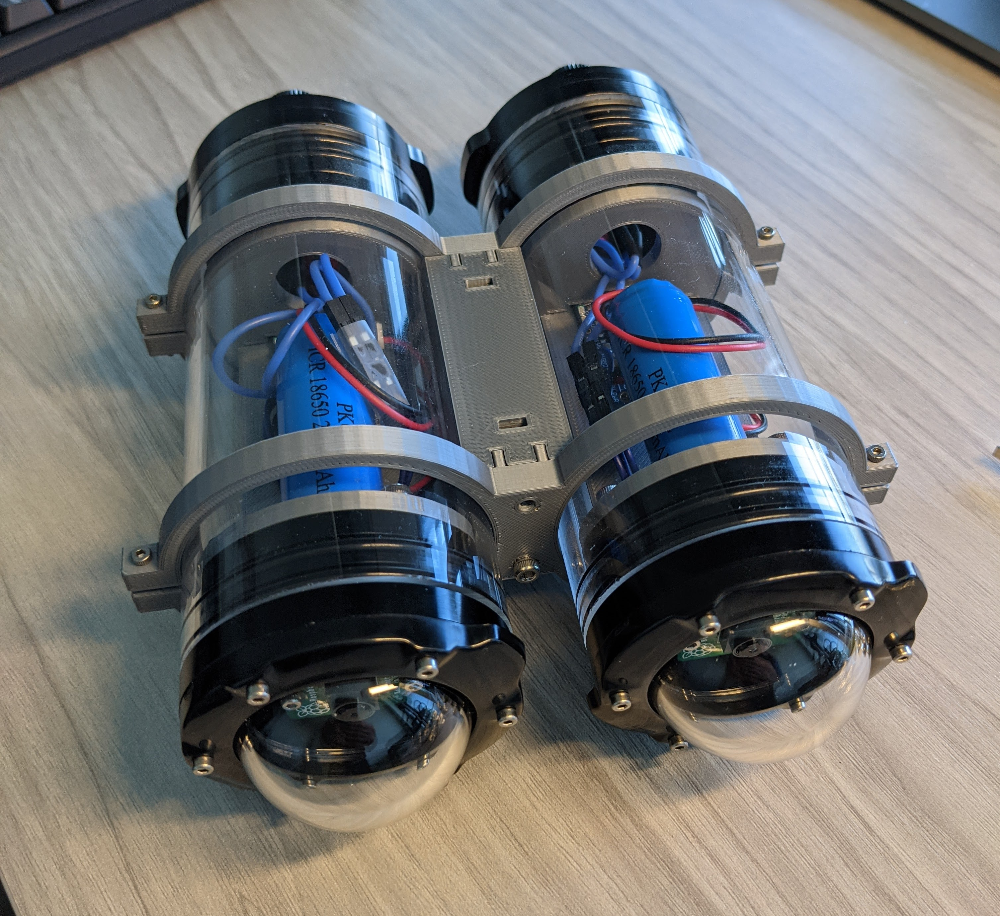
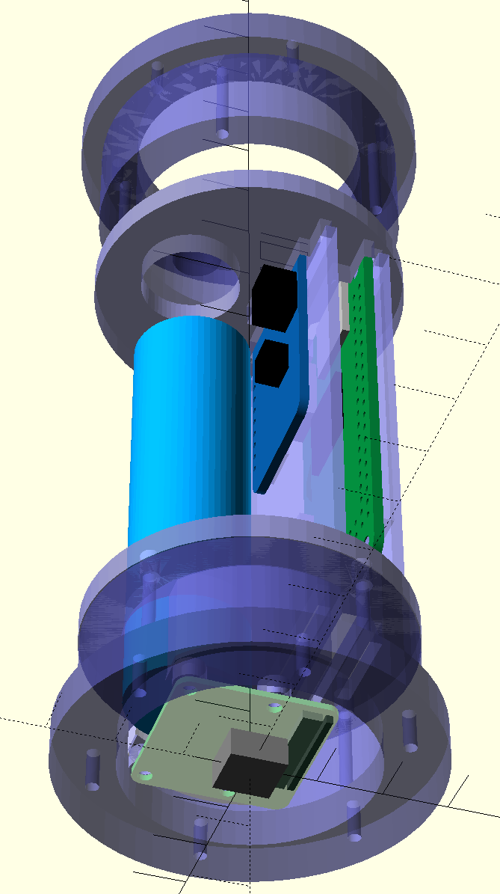
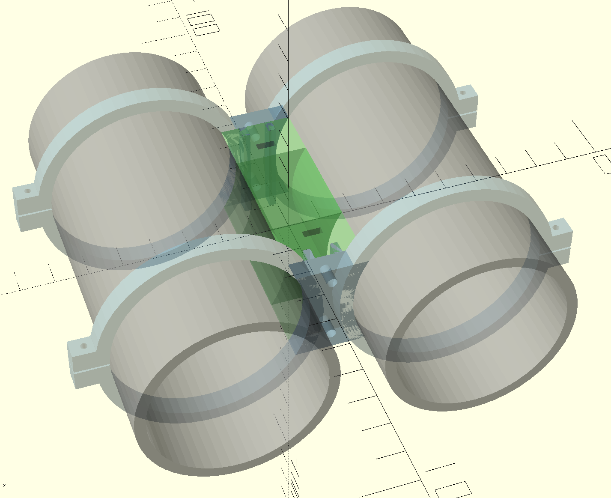

# Underwater camera

> **NOTE:** this is experimental, I will certainly make changes as I conduct field tests

This repo contains [OpenSCAD](http://www.openscad.org/) files for an underwater camera designed for a depth of 100m.
2 cameras can be combined to produce a stereo camera.

## Single camera

Each camera consists of the following:

* [Blue Robotics 2" tube](https://bluerobotics.com/product-category/watertight-enclosures/2-series/)
* [Blue Robotics 2" flange with dome](https://bluerobotics.com/product-category/watertight-enclosures/2-series/)
* [Blue Robotics 2" flange with penetrations](https://bluerobotics.com/product-category/watertight-enclosures/2-series/)
* [Blue Robotics external switch](https://bluerobotics.com/store/comm-control-power/switch/switch-10-5a-r1/)
* [Blue Robotics enclosure vent and plug](https://bluerobotics.com/store/cables-connectors/penetrators/vent-asm-r1/)
* [Adafruit PowerBoost 1000 Charger](https://www.adafruit.com/product/2465)
* [Adafruit Lithium Ion Cylindrical Battery - 3.7v 2200mAh](https://www.adafruit.com/product/1781)
* [Raspberry Pi camera, Raspberry Pi Zero W, Mini cable](https://www.adafruit.com/product/3414)

Printed parts:
* Power tray: `scad/print/power_tray.scad`
* Pi tray: `scad/print/pi_tray.scad`
* Camera bracket: `scad/print/cam_bracket.scad`
* Penetration bracket: `scad/print/pen_bracket.scad`

Mockup of the camera:

## Stereo camera

Additional printed parts:
* Stereo bracket: `scad/print/stereo_clamp.scad`
* Stereo mount: `scad/print/stereo_mount.scad`

## File organization:

* `scad/include` contains a few handy library components
* `scad/vitamin` contains non-printable parts useful for mocking up assemblies, including:
  * `pcb.scad` contains modules and constants for creating printed circuit boards
  * `adafruit.scad` contains Adafruit vitamins
  * `blue_robotics.scad` contains Blue Robotics vitamins
  * `pi_camera.scad` Pi Camera V1.2 vitamin
  * `pi_zero.scad` Pi Zero W vitamin
* `scad/assembly` an assembly is a combination of printable and non-printable parts
  * `ec.scad` shows how all of the parts fit together to build a single underwater camera
  * `sc.scad` shows how to combine 2 cameras into a stereo camera
* `scad/part` contains the actual printable parts
* `scad/print` renders the printable parts

A few of the files depend on [NopSCADlib](https://github.com/nophead/NopSCADlib).